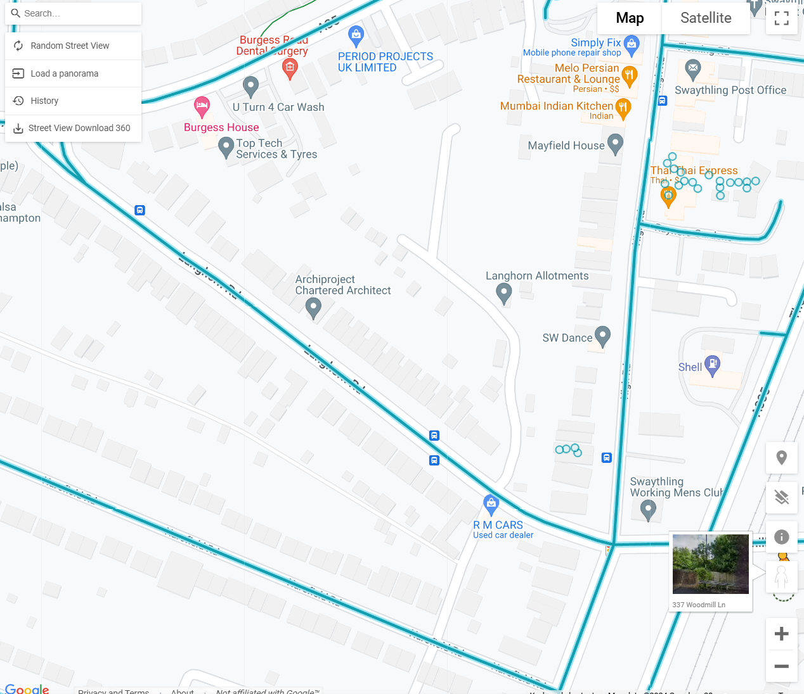

# Installation process - DroneAnywhereVR

Requirements:

- Meta Account
- Side Quest
- Meta Horizon Mobile App
- Smartphone with Bluetooth and WiFi
- DronesAnywhereVR APK from the Releases page
- USB cable

### Step 1: Meta Horizon setup

1. Create a Meta Account and sign in on the Quest 3 Headset: [link here](https://www.meta.com/en-gb/help/quest/articles/accounts/account-settings-and-management/set-up-meta-account-meta-quest/)
2. Download the Meta Horizon Mobile App from the Google Play Store [here](https://play.google.com/store/apps/details/Oculus?id=com.oculus.twilight&hl=en-US)
3. Open the Meta Horizon Mobile App and sign in with your Meta Account
4. There may be some verifications along the way such as two factor and email verification
5. Connect to the Meta Quest 3 with your Meta Horizon Mobile app (WiFi and Bluetooth must be enabled on your phone and Quest 3)
6. Allow developer mode on your Quest 3 by following the instructions on the Meta Horizon Mobile App

### Step 2: Install Side Quest on PC

1. Download and install Side Quest from [here](https://sidequestvr.com/#/download)
2. Connect your Quest 3 to your computer using a USB cable
3. Allow USB debugging on your Quest 3 inside the headset (A box will pop up asking you to allow USB debugging and click 'Allow')
4. Open Side Quest on the PC and wait for it to detect your Quest 3
5. Open the 'Open setup instructions' and connect to Quest 3
6. Download the DronesAnywhereVR APK from the Releases page of this website (Right hand side)
7. Return to Side Quest and click 'Install APK file from folder on computer
8. Select the DronesAnywhereVR APK file and click 'Open'
9. Wait for installation to complete
10. Remove headset from USB cable

### Step 3: Install DronesAnywhereVR Selector PC App

1. Head to the Releases page of this website and download the DronesAnywhereVR Selector PC App (exe file)
2. Run the exe file
3. The app will open and look like this: 
4. Open https://istreetview.com/ and find a location you want to go to
5. Copy the panoID from the street view page by clicking the string

6. Note, this won't work with all locations, specifically, this won't work for user uploaded panoramas shown here:

7. You'll know a panoID is incorrect if it overflows the text box like this:

8. Paste the panoID into the text box in the DronesAnywhereVR Selector App
9. Click 'Submit' and wait until a MemberID is generated

### Step 4: Open the DronesAnywhereVR App on the Quest 3

1. Open the DronesAnywhereVR app on the Quest 3
2. This will be in the 'Apps' Section of the Quest 3 (Bottom ribbon, More Apps)
3. Sort by Unknown Sources
4. Open the DronesAnywhereVR app

### Step 5: In the VR app

1. When the app opens up, use the right controller to navigate the menu
2. The menu can be opened and closed with the 'B' Button
3. Navigate the menu with the thumb stick
4. Select the relevant memberID from the list of 8 numbers (or the pre-set locations)
5. Wait for around 5 seconds for the scene to load
6. Enjoy your drone flight!

### Step 6: Troubleshooting

1. If a scene doesn't load in the correct location, try clicking the memberID number again and waiting for the scene to load
2. If the PC app doesn't generate a MemberID, try pasting the panoID again and clicking 'Submit' again (Sometimes the API doesn't respond or the internet is too slow to process before the timeout)
3. Check the length of the panoID before submitting (If it's too long and overflows the text box, it's likely incorrect)
4. If the drone doesn't move, try re-clicking a memberID number or the pre-set locations
5. Searching the istreetview website will take you to a rough location. Tips are to enter a postcode, cick the enter button, then manually search with the pegman icon to find a location you want to go to. Pegman can be found here where the image is in the bottom right corner of the screen, drag him to the map to open the streetview images:

